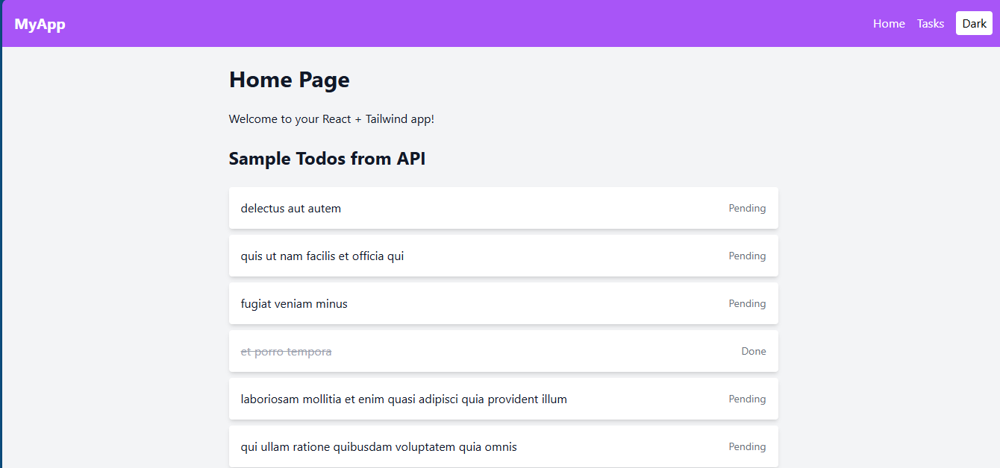
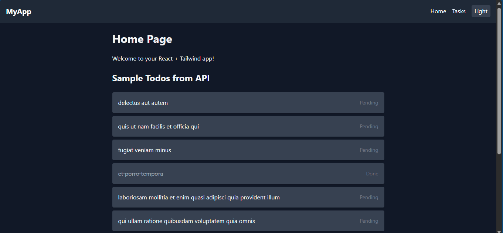
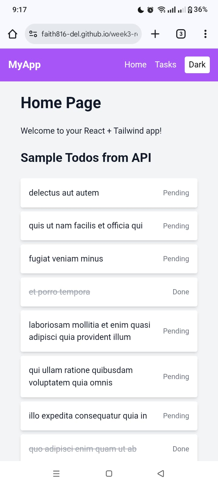
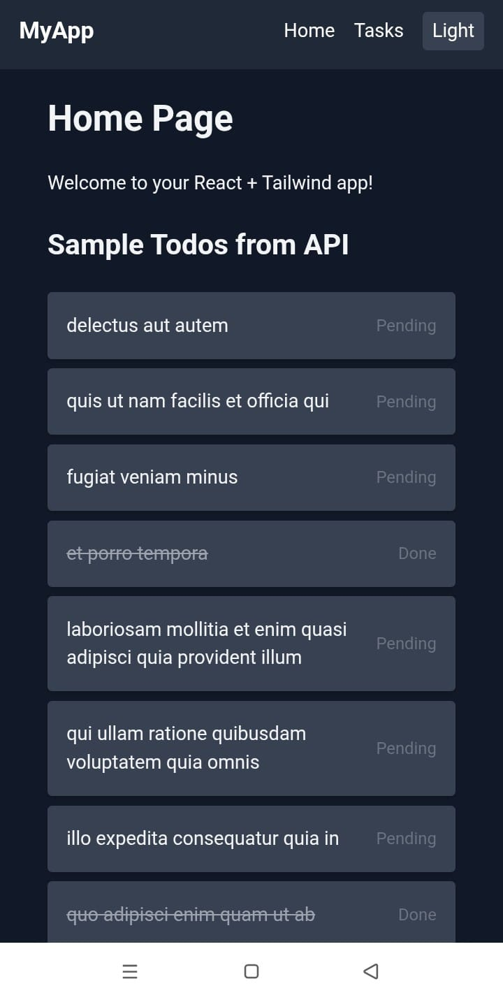

# React + Tailwind CSS Task & Todos App

## Overview
This project is a responsive React application built using **Vite** and **Tailwind CSS**. It demonstrates:

- Reusable UI components (Button, Card, Navbar, Footer, Layout)
- State management using **React hooks** (`useState`, `useEffect`)
- Persistent tasks using **localStorage**
- API integration with **JSONPlaceholder**
- Dark/Light theme toggle
- Responsive design for mobile, tablet, and desktop
---

## Features

1. **Task Manager**
   - Add new tasks
   - Mark tasks as completed
   - Delete tasks
   - Filter tasks (All, Active, Completed)
   - Tasks persist across sessions using localStorage

2. **Todos from API**
   - Fetches first 10 todos from JSONPlaceholder
   - Displays completed/pending status
   - Handles loading and error states

3. **Responsive Design & Styling**
   - Tailwind CSS utilities for spacing, typography, colors
   - Hover animations for buttons and cards
   - Mobile-first responsive layout

4. **Dark/Light Theme**
   - Toggle between dark and light mode
   - Preference saved in localStorage
---

## Project Structure
src/
├── api/ # API helper functions
├── components/ # Reusable UI components
├── context/ # Theme context provider
├── hooks/ # Custom hooks (e.g., useLocalStorage)
├── pages/ # Home and Task pages
├── utils/ # Utility functions (optional)
└── App.jsx # Main application component
---

## Setup Instructions

1. Clone the repository:  
```bash
git clone https://github.com/PLP-MERN-Stack-Development/react-js-jsx-and-css-mastering-front-end-development-faith816-del.git
cd react-js-jsx-and-css-mastering-front-end-development-faith816-del
npm install
npm run dev
```

## Screenshots

Desktop Light Mode:


Desktop Dark Mode:


Mobile Light Mode:


Mobile Dark Mode:

---

## Deployment

- Deployed using **Vercel / Netlify / GitHub Pages** (replace with your URL):  
`https://your-app-link.com`
